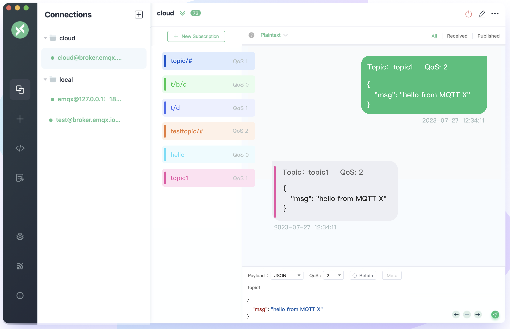

MQTTを初めて触ったことをただ伝える

KAZY

---
# 自己紹介


* KAZYと名乗っています。 
- 2025/05からOptFitという会社で働いています。
- 最近の趣味はSlackのリアクション作成です。 


今回MQTTなるプロトコルを学びました。

---
# お気に入りのSlack絵文字

||| | | |
|---|---|---|---|---|
|||| | |

---
# MQTTに興味を持ったきっかけ

なんか会社で使われていた。


1ヶ月くらい雰囲気で使ってた(vibe using?)がそろそろやばいなと思い調べることにした。


---

# MQTTってなに

* MQTT（Message Queuing Telemetry Transport）は、IoT（モノのインターネット）などで利用されている、軽量なメッセージングプロトコル

- Pub/Sub型プロトコル

  * Publisher と Subscriber がトピック経由で分離
  * MQTT: 常時接続 + push型(参考 HTTPは request/response)
- 小さい
  * ヘッダ最小2バイト
  * TCP上に展開されるプロトコル

---

# MQTT over WebSocket

こんなものもあるらしい。

* MQTTを WebSocket (port 443) でラップする技術
* Webアプリから MQTT に接続する際に有効


---

# なぜIoTに向いているのか

* 少ない資源で動作
* セッション維持
  * cleanSession / keepAlive / reconnect

* QoS(Quality of Service) 
    * QoS 0: at most once (最大1回)
    * QoS 1: at least once (最小1回)
    * QoS 2: exactly once (必ず1回)

* retain
  * メッセージをブローカーに保持し、後から接続したクライアントにも送信できる

---

## 社会実装例

Facebook Messengerで使われているという古の情報がよく出てくる。 今はわからない。

とにかく、IoT界隈ではMQTTが広く使われているらしい。

---
# パブリッククラウドとMQTT

* AWS IoT Core
  - AWSのIoTサービス
  - MQTTがマネージドサービスとして利用できる

* Azure IoT Hub
  - AzureのIoTサービス
  - MQTTがマネージドサービスとして利用できる

* Google Cloud IoT Core
  - 2023年サービス終了

Google Cloud がサ終しているのが印象的。

---

# 実際に動かす

今回の登場人物

- Mosquitto
- EMQX
- MQTTX
- paho-mqtt (Python)


---
# MQTTを動かすためのツール(ブローカー)


* Mosquitto
  - これはオープンソースのMQTTブローカーである
  ```brew install mosquitto```

* EMQX
  - これはもオープンソースのMQTTブローカーであるが、エンタープライズ感が強め
  ```shell
  docker run --name emqx
    -p 1883:1883 -p 8083:8083 -p 8084:8084
    -p 8883:8883 -p 18083:18083
    emqx/emqx-enterprise\:latest
  ```

---
# MQTTを動かすためのツール(クライアント)

* MQTTX
  - これはMQTTクライアントである
  - GUIで使いやすい
  - emqxが提供している

  ```
  brew install --cask mqttx
  ```



---

# MQTTを動かすためのツール(ライブラリ)

  ```python
  # paho-mqtt (Python)
  import paho.mqtt.client as mqtt
  def on_connect(client, userdata, flags, rc):
      print("Connected with result code ", rc)
      client.subscribe("test/topic")
  def on_message(client, userdata, msg):
      print(f"{msg.topic}: {msg.payload.decode()}")
  client = mqtt.Client()
  client.on_connect = on_connect
  client.on_message = on_message
  client.connect("localhost", 1883, 60)
  client.loop_start()
  client.publish("test/topic", "Hello MQTT!", retain=True)
  ```

---

# 動かす

やりたい
- ブローカーを立ち上げる
- 何らかのトピックで送る
- 受け取る
- retainをつけて送る
- 新しいクライアントで受け取る


---

## スライド 8: まとめ

* MQTTを簡単に紹介して動かした
- 明日から自身を持って仕事しよう


---

## 参考リンク

* [https://qiita.com/EMQTech/items/69b3fe39da6602b4326f](https://qiita.com/EMQTech/items/69b3fe39da6602b4326f)
* [https://github.com/emqx](https://github.com/emqx)
* [https://github.com/emqx/MQTTX](https://github.com/emqx/MQTTX)
* [https://github.com/eclipse-paho/paho.mqtt.python](https://github.com/eclipse-paho/paho.mqtt.python)
* [https://github.com/eclipse-mosquitto/mosquitto](https://github.com/eclipse-mosquitto/mosquitto)

